<p align="center">
  
</p>

# Wildlife Camera-Trap Species Classification & Domain-Shift Study

> **Robust wildlife species recognition in challenging camera-trap imagery with focus on domain shift**

 

[](https://www.python.org/downloads/)
[](https://pytorch.org/)
[](https://onnxruntime.ai/)
[](https://github.com/ultralytics/ultralytics)
[](https://github.com/huggingface/pytorch-image-models)
[](https://streamlit.io/)
[](https://wildlife-detector.streamlit.app/)
[](LICENSE)

##  Table of Contents
- [ Project Overview](#project-overview)
- [ Quick Start](#quick-start)
- [ Dataset](#dataset)
- [ Methodology](#methodology)
- [ Results](#results)
- [ Running the Project](#running-the-project)
- [ Project Structure](#project-structure)
- [ Web Application](#web-application)
- [ Documentation](#documentation)
- [ Contributing](#contributing)
- [ License](#license)
- [ Author](#author)
- [ Acknowledgments and References](#Acknowledgments-and-References)

##  Project Overview

### The Challenge
Camera-traps generate millions of images annually for wildlife monitoring, but manual sorting is slow and expensive. **Domain shift** — the accuracy drop when moving from *seen* to *unseen* camera locations — remains a critical challenge due to changes in backgrounds, lighting, and species appearance.

### Our Solution
A **two-stage pipeline** that achieves state-of-the-art cross-domain performance:

```
Raw Image →  MegaDetector v6 →  ConvNeXt Classifier →  Species Label
```

### Key Innovation
- **Stage 1**: Binary animal/vehicle detection with high recall
- **Stage 2**: Fine-grained 13-species classification on cropped regions
- **Result**: 27.5% error reduction on unseen locations vs. best single-stage baseline

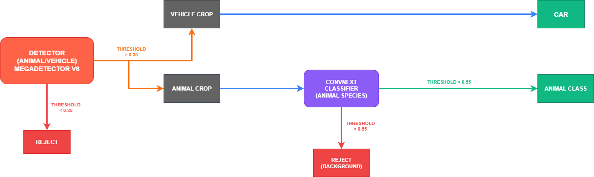

**What's in the diagram?**  

Stage 1: **MegaDetector v6** detects animals and vehicles.  
- Detections with confidence < 0.35 are rejected.  
- Vehicle crops are labeled as *Car*.  
- Animal crops are forwarded to Stage 2.  

Stage 2: **ConvNeXt classifier** identifies animal species.  
- Predictions with confidence < 0.55 are rejected as *Background*.  
- Confident predictions are assigned to the corresponding *Animal Class*.

###  Performance Summary

| Metric | CIS-Test (Seen) | TRANS-Test (Unseen) | Domain Gap |
|--------|-----------------|---------------------|------------|
| **F1 Score** | 0.903 | 0.773 | 0.13 |
| **Precision** | 0.904 | 0.750 | 0.15 |
| **Recall** | 0.902 | 0.816 | 0.09 |

*Smallest domain gap achieved among all tested configurations*

##  Quick Start

### Prerequisites
- Python 3.11+
- Dependencies (requirements.txt)

### Installation
```bash
# (Optional but recommended) Create and activate a virtual environment
python -m venv venv
source venv/bin/activate   # On Linux/Mac
venv\Scripts\activate      # On Windows

# Install Git LFS (only once on your system)
git lfs install

# Clone the repository
git clone https://github.com/ACM40960/project-projects-in-maths-modelling.git
cd project-projects-in-maths-modelling

# Pull large files (models, assets)
git lfs pull

# Install dependencies
pip install -r requirements.txt

```

### Quick Demo
```bash
# Run the web application
streamlit run web_app/app.py

# Or run evaluation-verification notebook
evaluation.ipynb
verification.ipynb
```
[Web App](https://wildlife-cameratrap.streamlit.app/)

###  Quick Navigation

**Want to dive right in?**
-  **[Web App](https://wildlife-cameratrap.streamlit.app/)** - Interactive demo
-  **[View Results](evaluation.ipynb)** - Complete evaluation analysis  
-  **[Test Pipeline](verification.ipynb)** - End-to-end pipeline results on verification set
-  **[EDA](notebooks/eda_and_dataset_prep.ipynb)** - Exploratory Data Analysis

-  **[Training Scripts](scripts/)** - Experiments
-  **[Evaluation Notebooks](eval/)** - Results of all experiments


## Dataset

### CCT20 Benchmark Subset
The CCT20 benchmark (Beery et al., ECCV 2018) is a curated subset of the Caltech Camera Traps dataset, containing over 51,000 downsized images (max edge ≤ 1024 px) from 20 camera locations.  
- 15 wildlife species + vehicle (13 of them used in our project)  
- CIS: Seen locations (train/val/test)  
- TRANS: Unseen locations (test only), used to evaluate real-world generalization  

Our pipeline is trained only on CIS train/val and evaluated on both CIS-test and TRANS-test.

The full Caltech Camera Traps dataset contains approximately 243,000 images from 140 locations. CCT20 includes 57,864 images with bounding boxes.

### Download Links
| Resource | Size | Link |
|----------|------|------|
| Benchmark Images | 6 GB | [Download](https://storage.googleapis.com/public-datasets-lila/caltechcameratraps/eccv_18_all_images_sm.tar.gz) |
| Metadata & Splits | 3 MB | [Download](https://storage.googleapis.com/public-datasets-lila/caltechcameratraps/eccv_18_annotations.tar.gz) |

More details: [Caltech Camera Traps Project Page](https://beerys.github.io/CaltechCameraTraps/)

### Citation
If you use this dataset, please cite:
```bibtex
@inproceedings{DBLP:conf/eccv/BeeryHP18,
  author    = {Sara Beery and Grant Van Horn and Pietro Perona},
  title     = {Recognition in Terra Incognita},
  booktitle = {Proc. ECCV 2018},
  pages     = {472--489},
  year      = {2018},
  doi       = {10.1007/978-3-030-01270-0_28}
}
```

---

### Key Challenges
- **Illumination**: Night-time IR imagery with low contrast
- **Motion blur**: Fast-moving animals with slow shutters  
- **Occlusion**: Vegetation blocking key features
- **Class imbalance**: Long-tailed species distribution
- **Location bias**: Background-dependent features

<div align="center" style="margin:0 0 28px;">
  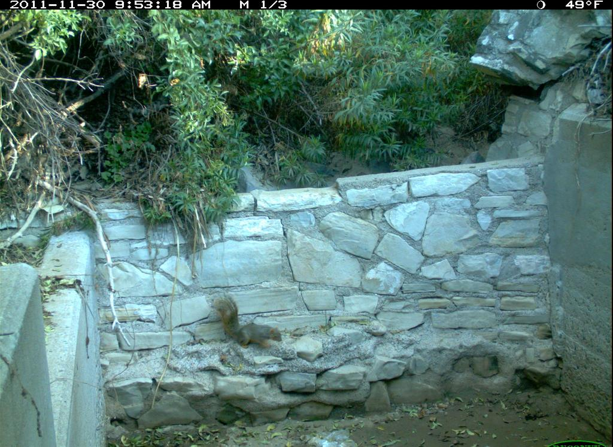
  <div style="margin-top:8px;"><sub>Seen (in-domain) Example — Squirrel, daylight</sub></div>
</div>

<div align="center" style="margin:0 0 28px;">
  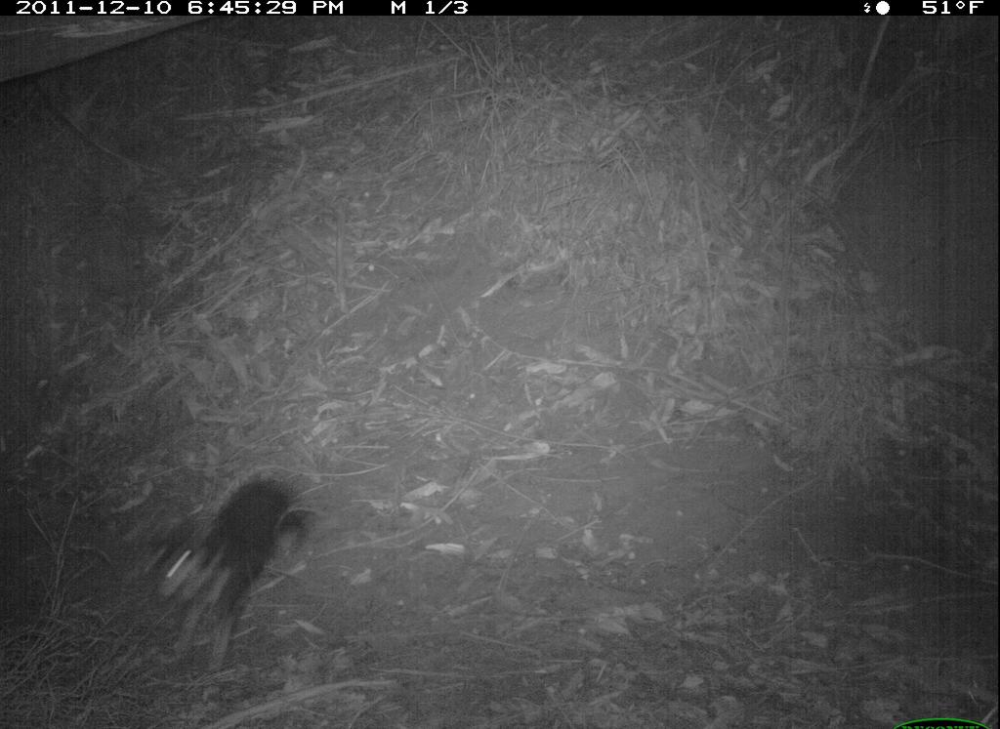
  <div style="margin-top:8px;"><sub>Unseen (out-of-domain) Example — Dog, night IR</sub></div>
</div>


##  Methodology

### Experiments Overview
We evaluated multiple detection and classification strategies before arriving at our final two-stage pipeline.  
For full results, charts, and training details, see the **[Web Application](#web-application)**, **[Evaluation Notebook](#evaluation-notebook)** sections and for further **[Scripts](scripts/)** folder.

1. **Single-stage detectors**  
   Benchmarked **YOLOv8** and **MegaDetector-v6** on the 14-species CCT subset (includes "car").  
   - MegaDetector-v6 achieved the highest overall metrics and smallest domain-shift drop (ΔF1 ≈ 0.16).  
   - YOLOv8 with *medium augmentation* was the strongest YOLO variant, but still lagged MDv6 by ~7 mAP on unseen sites.

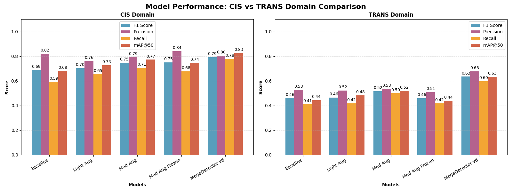
*Comparison of Recall, F1 Score, mAP50, and Precision for CIS (in-domain) vs TRANS (out-of-domain) locations.*

2. **Two-stage pipeline**  
   **Stage 1** – Retrained MDv6 (animal vs vehicle) for high recall.  
   **Stage 2** – Fine-tuned **ConvNeXt-Small** for species classification, using class-balanced focal loss and tail-focused augmentations.  
   - Achieved F1 = **0.903** (CIS) and **0.773** (TRANS), reducing the cross-domain gap by ~27% while maintaining high rare-species recall.
  
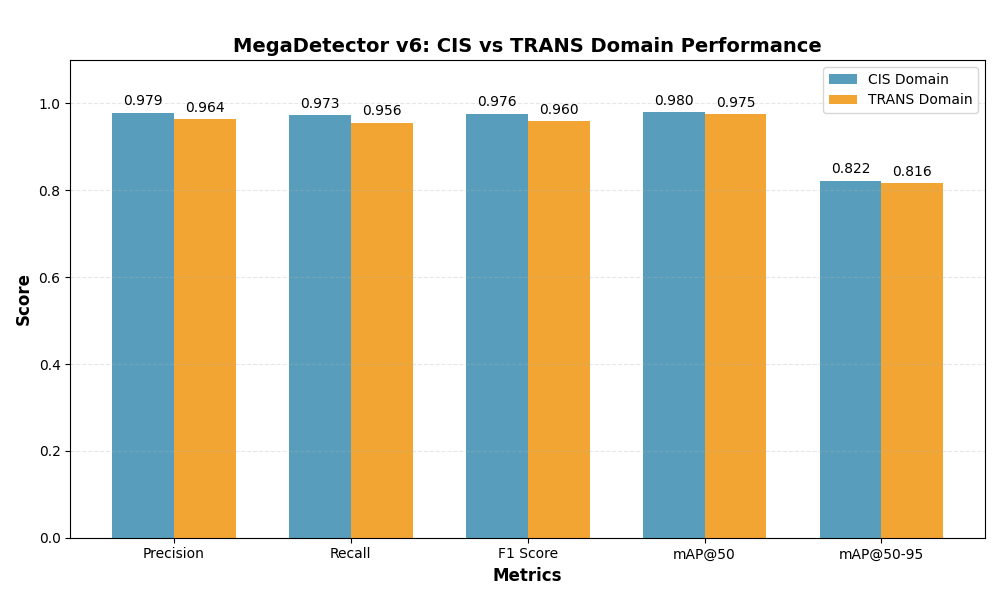
*Comparison of Recall, F1 Score, mAP50, mAP50-95 and Precision for CIS (in-domain) vs TRANS (out-of-domain) locations.*
  
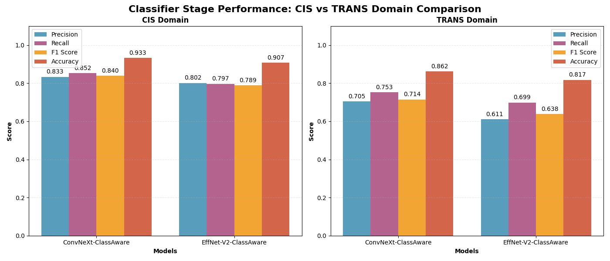
*Comparison of Recall, F1 Score, Accuracy, and Precision for CIS (in-domain) vs TRANS (out-of-domain) locations.*

### Architecture Overview

### Stage 1: MegaDetector v6 (YOLOv9-Compact)
- **Purpose**: High-recall detection of animals and vehicles
- **Architecture**: YOLOv9-Compact with FPN and SPPF modules
- **Training**: Binary classification (animal vs vehicle)
- **Performance**: F1 = 0.96+ on both domains

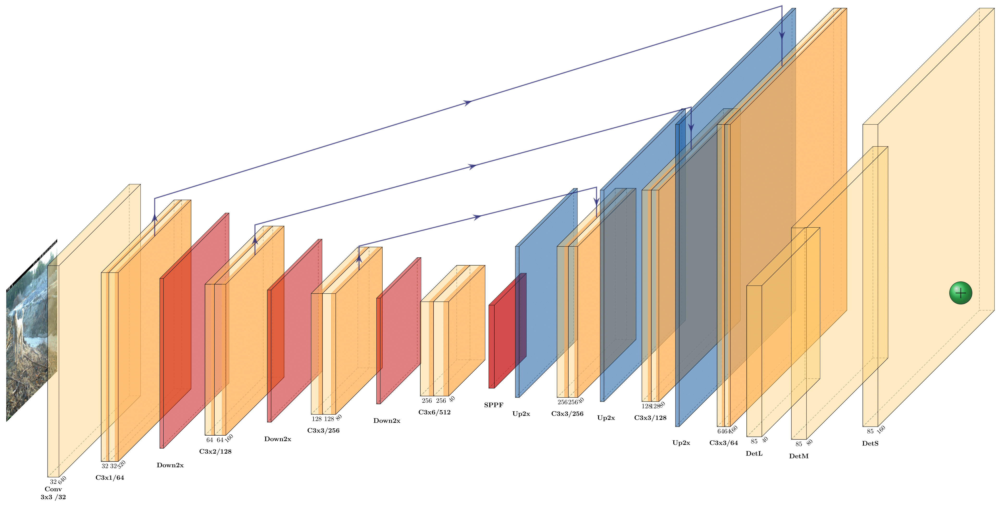

### Stage 2: ConvNeXt-Small Classifier  
- **Purpose**: Fine-grained species classification
- **Features**: ViT-inspired CNN with 7×7 depthwise convolutions
- **Training**: Class-balanced focal loss + weighted sampling
- **Innovation**: Tail-aware augmentation for rare species

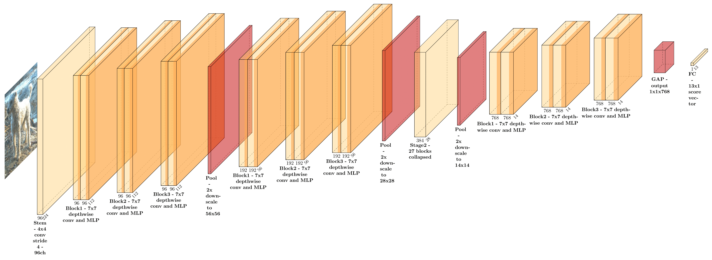

### Technical Innovations
- **Class-Balanced Focal Loss**: Addresses long-tail distribution
- **Domain-Aware Training**: Freeze-unfreeze scheduling
- **Confidence Gating**: Two-threshold system for robustness

##  Results

### Domain Shift Performance

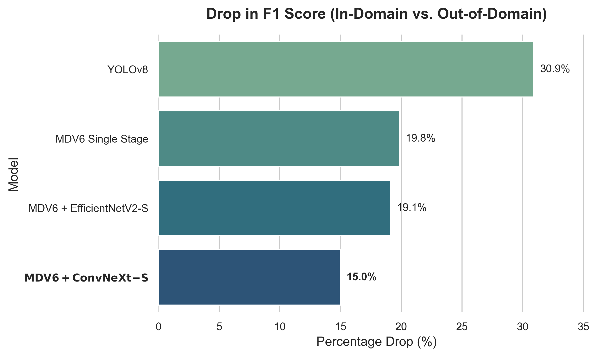
*Each result represents the best-performing run for that model.*

### Cross-Domain Model Performances 

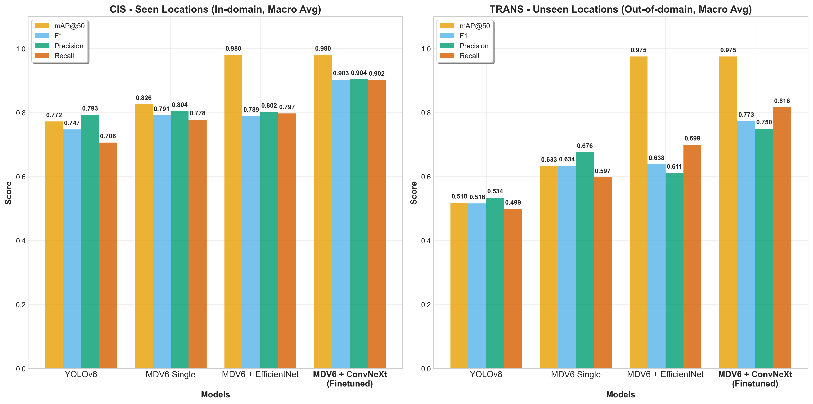
*Each result represents the best-performing run for that model.*

### Per-Species Analysis

<p align="center">
  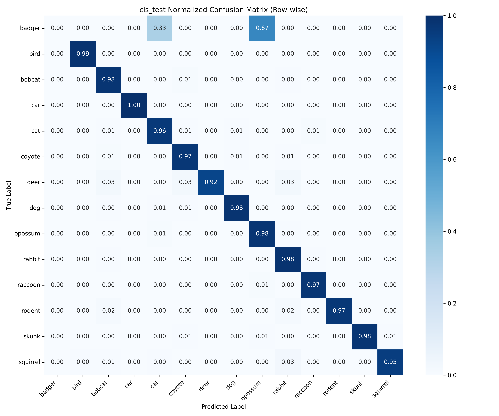
  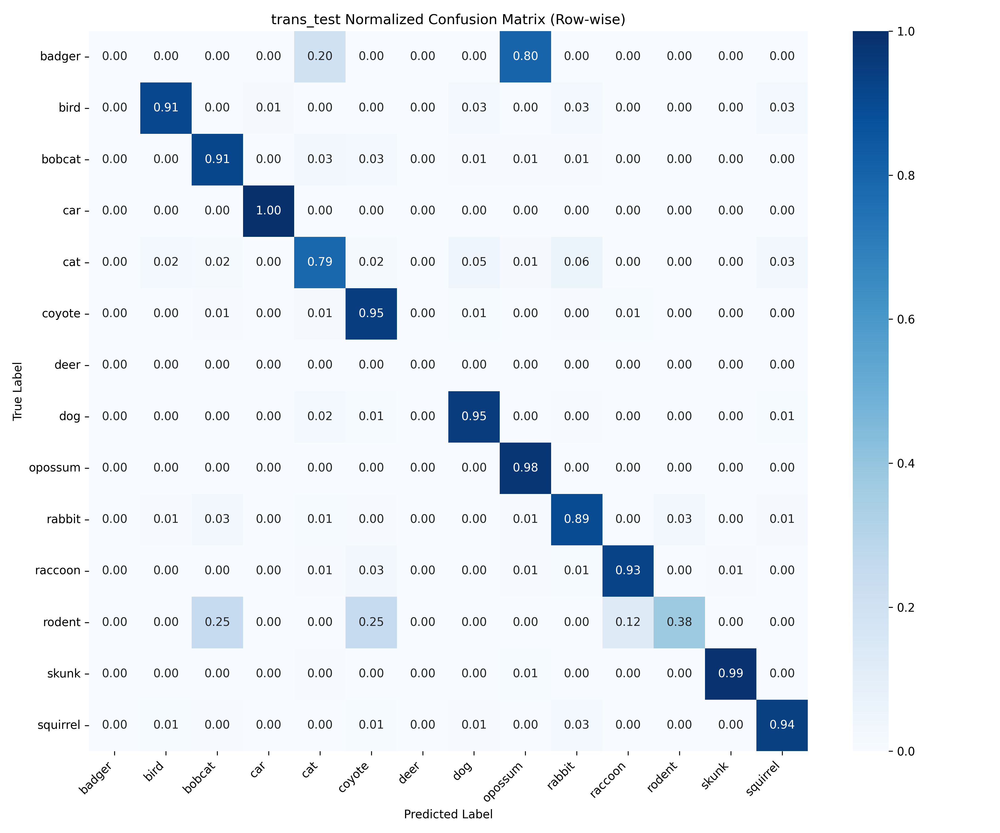
</p>

*Confusion matrices for test splits, CIS (in-domain) and TRANS (out-of-domain) using the final pipeline: MegaDetector v6 + ConvNeXt-Small.*

*Detailed per-class metrics available in the [evaluation notebook](evaluation.ipynb)*

##  Running the Project

### 1. Web Application Demo
```bash
streamlit run web_app/app.py
```
An interactive app with project details and live inference, for more please see the **[Web Application](#web-application)** section.

### 2. Evaluation Notebook

**Camera-Trap Detection & Classification — End-to-End Project Notebook**

A full walkthrough of the project, covering the entire modelling process from single-stage baselines to the final two-stage pipeline.

**Inside you’ll find:**
- **Model development:** YOLOv8 variants, retrained MegaDetector-v6 (animal vs vehicle), and fine-grained classifiers (ConvNeXt-Small, EfficientNetV2).
- **Training diagnostics:** Loss curves, validation trends, and augmentation schedules.
- **Quantitative evaluation:** Precision, Recall, F1, mAP-50, CIS vs TRANS breakdowns, per-class metrics.
- **Confusion-matrix analysis:** Side-by-side heatmaps with insights on rare-class and look-alike errors.
- **End-to-end pipeline testing:** Detector → Classifier with confidence gating and threshold tuning.

*Data covers 14 animal classes + vehicle, with CIS (in-domain) and TRANS (unseen) splits. For the spoiler-free summary, the final pipeline reaches >94 % weighted F1 on unseen sites.*
[Open Evaluation Notebook](evaluation.ipynb)

---

### 3. Verification Notebook

**Verification Notebook Walkthrough**

An evaluation-only notebook for the final two-stage model (**MegaDetector v6 + ConvNeXt-Small**), run on two held-out verification splits.

**What it does:**
- **Stage 1 – Detection:** MegaDetector v6 (ONNX) locates animals and vehicles at a low threshold (0.35) to favour recall.
- **Stage 2 – Classification:** ConvNeXt-Small (ONNX) refines animal detections into 13 species, rejecting low-confidence crops (≥ 0.55 threshold).
- **Metrics:** Precision, Recall, F1, mAP, per-class accuracy, CIS–TRANS accuracy deltas.
- **Qualitative checks:** Side-by-side overlays of ground truth vs predictions for random samples.
- **Matching rules:** IoU ≥ 0.30 or ≥ 60 % GT box enclosed.

*All detections and metrics are cached for instant reproduction; thresholds were grid-searched and fixed for this study.*
[Open Verification Notebook](verification.ipynb)


##  Project Structure

```
wildlife-camera-trap-classification/
├──  configs/                     # Training configurations
│   ├── megadetector_test/         # MegaDetector configs
│   ├── model/                     # YOLO Configurations  
│   └── test/                      # Test configurations
├──  data/                       # Dataset files
│   ├── preprocessed/              # Cleaned COCO annotations
│   └── verification/              # Verification image subset
├──  eval/                       # Evaluation results & metrics
│   ├── classifier_stage/          # Species classifier results
│   ├── single_stage/             # Single stage model results
│   ├── detector_stage/            # Object detector results
│   ├── pipeline_results/          # End-to-end pipeline metrics
│   ├── evaluation_classifier.ipynb            # Classifier stage eval notebook
│   ├── evaluation_detector.ipynb            # Detector stage stage eval notebook
│   ├── evaluation_pipeline.ipynb            # Full pipeline eval notebook
│   └── evaluation_singleStage.ipynb            # Single-stage models eval notebook
├──  models/                     # Exported ONNX models
│   ├── megadetectorv6.onnx       # Animal/vehicle detector
│   └── convnext_classifier.onnx   # Species classifier
├──  notebooks/                  # Jupyter notebooks
│   └── eda_and_dataset_prep.ipynb # Exploratory data analysis
├──  reports/                    # Generated evaluation reports of full pipeline (Verification set)
├──  scripts/                    # Training & preprocessing scripts (See the individual folder for further)
│   ├── augmentation/              # Data augmentation pipelines
│   ├── dataset/                   # Dataset preparation utilities
│   └── train/                     # Model training scripts
├──  web_app/                    # Streamlit web application
├──  evaluation.ipynb            # Complete model evaluation
├──  verification.ipynb          # Pipeline verification
├──  requirements.txt            # Python dependencies
└──  README.md                   # This file
└── Project_Poster.pdf              # Poster Presentation of project
```

*For detailed information about each component consists info, see the individual README files in each folder **[here](#Documentation)** * .

##  Web Application

### Features
- **Project Overview:** Explains the motivation, challenges, and our two-stage pipeline design.  
- **Dataset & Experiments:** Details on CCT20 subset, training setups, and reasoning behind design choices.  
- **Results & Comparisons:** Well-curated figures, tables, and confusion matrices for CIS vs TRANS evaluation.  
- **Literature Context:** Background on related works and why our approach matters.  
- **Live Inference Tab:** Test the final pipeline interactively — the app runs the detector + classifier in real-time and shows predictions vs ground truth.

### Demo Screenshots

<div align="center" style="margin:0 0 28px;">
  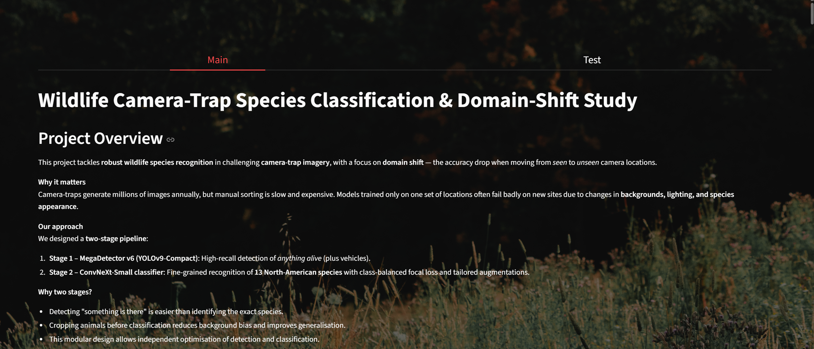
  <div style="margin-top:8px;"><sub>Project Details</sub></div>
</div>

<div align="center" style="margin:0 0 28px;">
  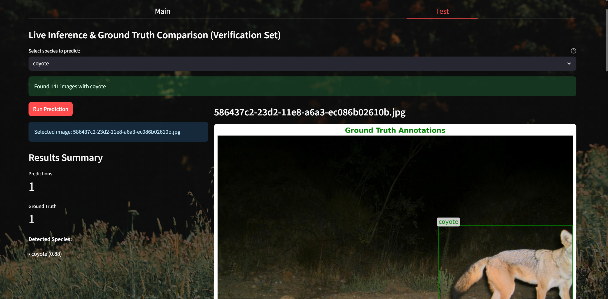
  <div style="margin-top:8px;"><sub>Live Inference</sub></div>
</div>

### Launch Instructions
```bash
cd project-projects-in-maths-modelling/
streamlit run web_app/main.py
```

Navigate to `http://localhost:8501` to access the application.

**OR**

Go to [**this**](https://wildlife-cameratrap.streamlit.app/) deployed website, easy.

##  Documentation

### Detailed Component Documentation
- **[Scripts](scripts/)**: Training and preprocessing utilities
- **[Evaluation](eval/)**: Metrics and analysis results  
- **[Web App](web_app/)**: Application setup and features

### Key Notebooks
| Notebook | Purpose |
|----------|---------|
| [Evaluation](evaluation.ipynb) | **Complete model comparison & training analysis** |
| [Verification](verification.ipynb) | **End-to-end pipeline testing on verification set** |
| [EDA](notebooks/eda_and_dataset_prep.ipynb) | **Dataset exploration & preprocessing** |


### Full Evaluation Notebooks
| Notebook | Purpose |
|----------|---------|
| **Classifier Stage** | **Complete evaluation on experimented classifiers as 2nd stage** |
| **Detector Stage** | **Evaluation on MegadetectorV6 model as as 1st stage** |
| **Single Stage** | **Complete evaluation on experimented single stage models** |
| **Full Pipeline** | **Complete Evaluation of Full 2-Stage Pipeline** |

*For detailed information about each evaluation notebook, see the individual README file **[here](eval/)** * .


##  Technical Approach

### Why Two-Stage Pipeline?
1. **Decoupled Optimization**: Detection and classification trained separately
2. **Background Invariance**: Cropping reduces location-specific bias
3. **Modular Design**: Components can be upgraded independently  
4. **Domain Robustness**: Locating "something alive" generalizes better than specific species recognition

### Novel Contributions
- **Tail-Aware Training**: Specialized augmentation banks for rare species
- **Cross-Domain Evaluation**: Comprehensive analysis of location generalization

##  Key Achievements

-  **State-of-the-art** cross-domain performance on CCT20 benchmark
-  **27.5% error reduction** on unseen locations vs. best baseline
-  **High recall maintenance** for rare species under domain shift
-  **Production-ready** ONNX models with web interface

## Contributing

Contributions are welcome to improve the app, extend experiments, or refine documentation.  
You can help by:  
- **Enhancing features:** Add new visualizations, metrics, or UI improvements.  
- **Extending experiments:** Try different datasets, architectures, or augmentation strategies.  
- **Improving documentation:** Clearer explanations, figures, or setup instructions.  
- **Adding models/datasets:** Integrate new classifiers or apply the pipeline to other wildlife benchmarks.  

How to contribute:  
1. Fork the repository and create a new branch.  
2. Commit your changes with a clear description.  
3. Open a pull request to share your work.  

*Even small improvements (polishing figures or fixing code formatting) are valuable!* 


##  License

This project is licensed under the MIT License - see the [LICENSE](LICENSE) file for details.

##  Citation

If you use this work in your research, please cite:

```bibtex
@misc{wildlife_camera_trap_2025,
  title={Wildlife Camera-Trap Species Classification with Domain-Shift Robustness},
  author={Sukru Deniz Cilek},
  year={2025},
  institution={University College Dublin},
  note={M.Sc. Project}
}
```

##  Author

**Şükrü Deniz Çilek**
-  Email: [ukru.cilek@ucdconnect.ie](mailto:ukru.cilek@ucdconnect.ie)
-  LinkedIn: [https://www.linkedin.com/in/denizcilek/](https://www.linkedin.com/in/denizcilek/)
-  Institution: University College Dublin, M.Sc. Data & Computational Science

---

##  Acknowledgments and References

- **Microsoft AI for Earth** for MegaDetector v6
- **Caltech Camera Traps** team for the CCT20 dataset
- **Meta AI Research** for ConvNeXt architecture
- **Ultralytics** for YOLOv8 framework

### References

- Beery, S., Van Horn, G., & Perona, P. (2018). **Recognition in Terra Incognita.**  
  *Proceedings of the European Conference on Computer Vision (ECCV)*, 472–489.  
  [https://doi.org/10.1007/978-3-030-01270-0_28](https://doi.org/10.1007/978-3-030-01270-0_28)

- Norouzzadeh, M. S., Nguyen, A., Kosmala, M., Swanson, A., Palmer, M. S., Packer, C., & Clune, J. (2018).  
  **Automatically identifying, counting, and describing wild animals in camera-trap images with deep learning.**  
  *PNAS*, 115(25), E5716–E5725.  

- Microsoft AI for Earth. (2023). **MegaDetector v6 Release Notes.**  
  [https://github.com/microsoft/CameraTraps](https://github.com/microsoft/CameraTraps)

- Liu, Z., Mao, H., Wu, C.-Y., Feichtenhofer, C., Darrell, T., & Xie, S. (2022). **A ConvNet for the 2020s.**  
  *CVPR 2022.*  

- Cui, Y., Jia, M., Lin, T.-Y., Song, Y., & Belongie, S. (2019). **Class-Balanced Loss Based on Effective Number of Samples.**  
  *CVPR 2019.*  

- Cunha, M. S., et al. (2023). **Strategies for long-tailed visual recognition.**  
  *Pattern Recognition*, 138, 109398.  

- Mustafić, S., et al. (2024). **Species Detection & Classification from Camera Trap Data.**  
  *Ecological Informatics*, 76, 102379. 


---

*This project demonstrates the effectiveness of two-stage architectures for robust wildlife monitoring under domain shift, contributing to automated conservation efforts worldwide.*
